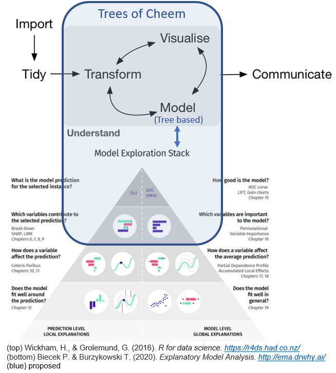
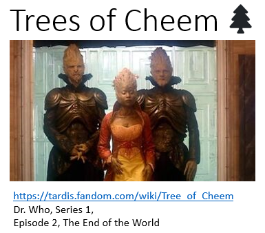

<!-- README.md is generated from README.Rmd. Please edit that file -->

## Context

Consider multivariate numeric data with the goal of applying machine
learning. `Trees of Cheem` applies tree based models and explores the
space around the “shapely values” (see [Explanatory Model Analysis,
SHAP](https://ema.drwhy.ai/shapley.html#SHAPRcode)) of a new, out of
sample, observation. To do so we want to view a *tour*, an animation of
linear projections as the projection basis changes to nearby frames.

In terms of workflow and model specificity:



<!-- ## Repo Structure -->
<!-- The case studies that produce the videos and still images found in the paper -->
<!-- can be reproduced in R via running the files found in the `scripts` directory.  -->
<!-- ```{r, echo = FALSE, } -->
<!-- fs::dir_tree(recurse = TRUE,   -->
<!--              type = c("file", "directory"), -->
<!--              glob = c("*.png|*.pdf|*.cls|*.bib|*.html"), -->
<!--              invert = TRUE) -->
<!-- ``` -->

## Namesake


